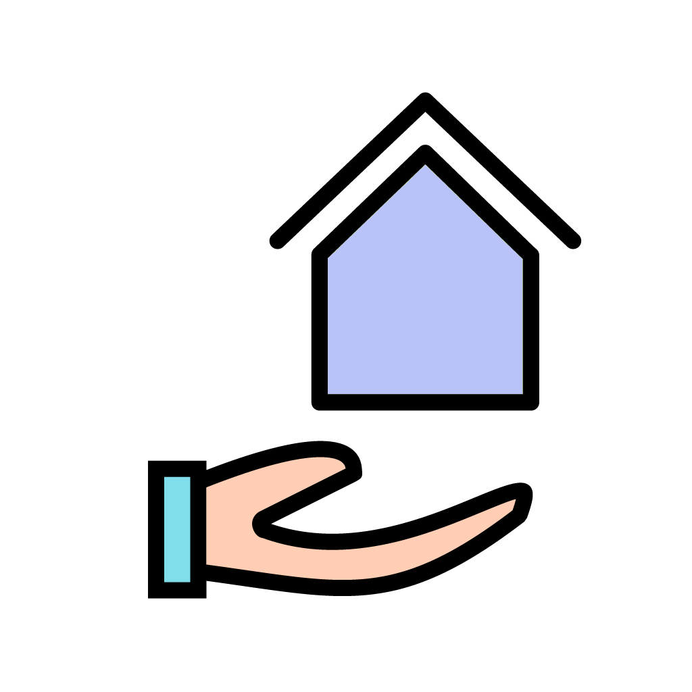

# HERO Chatbot  
**Housing Essential Resource Organization**



A rebranded, user-focused **Retrieval-Augmented Generation (RAG)** chatbot to help frontline workers and individuals find affordable housing resources.

## 💻 Tech Stack

- **Frontend:** Next.js (`sites/chatbot`)
- **Backend:** NestJS (`api/`)
- **LLM Microservice:** FastAPI (`python-llm-service/`)
- **Extras:** Markdown context, Python 3.x, Yarn

## ✨ Key Features

- RAG with markdown-based static content  
- Python microservice for LLM-based answers  
- Live housing listings from Bloom Housing API  
- Modular, scalable structure

## ⚙️ Local Setup

1. **Clone**
   ```bash
   git clone https://github.com/glarerena/hero-jtc-2025.git
   cd jtc-capstone-2025
   ```

2. **Start Python Service**
   ```bash
   cd python-llm-service
   python3 -m venv venv
   source venv/bin/activate
   pip install -r requirements.txt
   uvicorn app:app --reload --port 8000
   ```

3. **Start NestJS Backend**
   ```bash
   cd api
   yarn install
   yarn start
   ```

4. **Run Frontend**
   ```bash
   cd sites/chatbot
   yarn install
   yarn dev
   ```

Then visit: `http://localhost:3000`

## ▶️ Usage

Visit the app in your browser and ask the HERO chatbot questions about affordable housing. The system uses RAG and AMI filtering to provide accurate, context-aware responses based on housing resource information.

## 🗂️ Folder Structure (Highlights)

```
api/                  # NestJS backend
context/              # Markdown knowledge base
python-llm-service/   # FastAPI + LLM logic
sites/chatbot/        # Next.js frontend
assets/               # Screenshots & flowcharts
```

Other files (ignored in repo):
- `developers_guide.md`
- `ethics_disclaimer.md`
- `project_update.md`
- `structure.txt`

## 📄 License

MIT License — free to use, modify, or extend.
